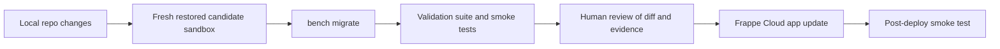

# InductOne Tools

InductOne Tools is the Plus One Robotics ERPNext/Frappe application that supports the InductOne configuration, builder-release, completion, as-built, instance, engineering-signoff, part-numbering, and supporting BOM workflows.

This repository is intended to become the authoritative, handoff-ready source for the InductOne application logic and deployable configuration. Operational production records remain owned by the ERPNext database and backups.

## Documentation

Start here:

- [Documentation index](docs/README.md)
- [Architecture overview](docs/architecture.md)
- [InductOne build-to-instance workflow](docs/workflows/inductone-build-to-instance.md)
- [Source-of-truth policy](docs/deployment/source-of-truth-policy.md)
- [Fixture policy](docs/deployment/fixture-policy.md)
- [Current fixture manifest](docs/deployment/fixture-manifest.md)
- [Sandbox restore and validation runbook](docs/deployment/sandbox-restore.md)
- [Release checklist](docs/deployment/release-checklist.md)
- [Rollback runbook](docs/deployment/rollback.md)
- [Lifecycle and state-machine reference](docs/workflows/lifecycle-reference.md)
- [Permission matrix](docs/security/permission-matrix.md)
- [Permission hardening test plan](docs/security/permission-test-plan.md)
- [Whitelisted method inventory](docs/security/whitelisted-methods.md)
- [Hardening roadmap](docs/audit/hardening-roadmap.md)

## Current operating principle

Preserve the production user experience while making the implementation more defensible:

1. Treat production behavior as the baseline.
2. Test changes in a restored sandbox before deployment.
3. Keep deployable configuration in the repo intentionally.
4. Keep operational records out of fixtures.
5. Enforce business gates server-side, with client scripts used for operator experience.
6. Document every workflow, permission boundary, and deployment step well enough for handoff.

## Deployment model

The target release flow is:

The production GUI fixture export path is transitional. It should become an audit/reconciliation tool, not the normal deployment source of truth.

## Safety note

This repository contains deployable ERPNext customization. Do not push or deploy changes that alter fixtures, hooks, permissions, lifecycle validation, or whitelisted methods without first validating against a restored sandbox.
