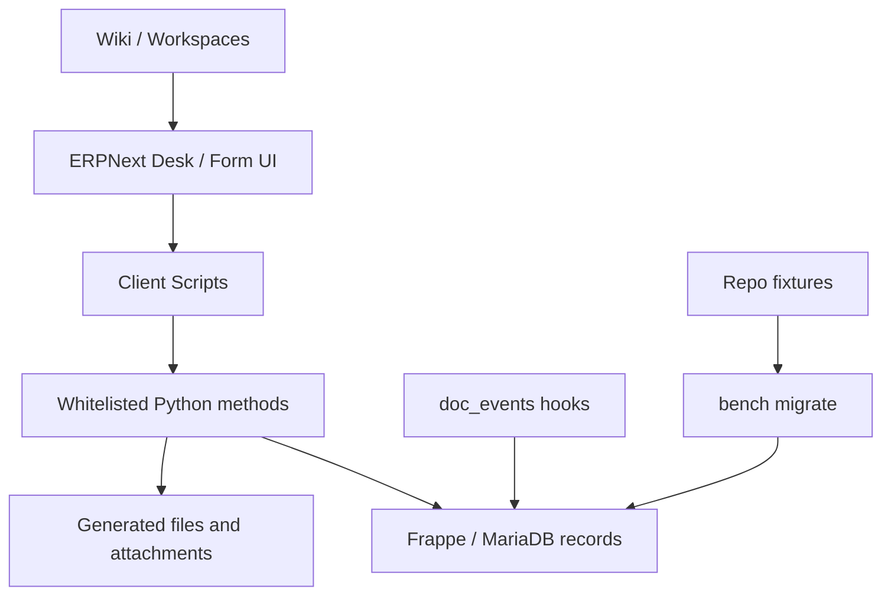

# Architecture Overview

InductOne Tools is a custom Frappe app that extends ERPNext for Plus One Robotics' InductOne operational process. It combines custom DocTypes, client-side form scripts, Python server actions, server-side validation hooks, fixtures, file generation, and ERPNext/Wiki operational content.

The long-term architectural goal is simple:

- Code and deployable configuration are repo-owned.
- Operational records are database-owned.
- Business rules are enforced server-side.
- Client scripts improve the user experience but do not serve as the only gate.
- Every deployment is validated in a restored sandbox before production.

## System boundary

InductOne Tools owns or coordinates these functional areas:

- InductOne Build creation and option selection.
- Configured BOM snapshot generation and hierarchy/diff tooling.
- BOM export package generation.
- InductOne Configuration Order creation and flat BOM generation.
- Builder release and builder-facing workbook/package creation.
- Builder tranche and InductOne serial allocation.
- Build completion upload and workbook parsing.
- Review, rejection, and acceptance of builder completions.
- Locked As-Built Record creation.
- InductOne Instance creation and lifecycle tracking.
- Engineering signoff for controlled Items, BOMs, Product Bundles, and Configuration Options.
- Part number allocation and assignment controls.
- Fixture export tooling during the transitional deployment model.

## Major implementation surfaces

## Repo-owned Python modules

| Module | Responsibility |
|---|---|
| `bom_export.py` | BOM Export Package validation and generation. |
| `builder_release.py` | Builder readiness checks, release package creation, release acknowledgement, builder workbook artifacts, legacy as-built helper methods. |
| `build_completion.py` | Build Completion upload, workbook parsing, server-side completion lifecycle validation. |
| `build_completion_accept.py` | Atomic acceptance operation: As-Built, Completion Accepted, Build update, CO close, Instance creation. |
| `build_completion_workbook_parser.py` | Builder workbook parsing and validation against Build serial. |
| `engineering_signoff.py` | Engineering signoff lifecycle for controlled engineering artifacts. |
| `fixture_sync.py` | Transitional GUI-triggered fixture export and push utility. Should become audit-only. |
| `part_numbering.py` | Part number allocation, assignment, and controlled Item/Product Bundle validation. |
| `configured_bom/flat_bom.py` | Flat BOM generation for configuration orders. |
| `instance/creation.py` | Instance creation from locked As-Built records. |
| `instance/hooks.py` | Instance serial and lifecycle validation. |
| `instance/backfill.py` | Backfill creation for existing units outside the formal pipeline. |
| `serial_allocation/tranche.py` | Builder tranche validation and atomic serial allocation primitive. |
| `serial_allocation/release.py` | Build-level serial allocation and preview endpoint. |
| `serial_allocation/co_sync.py` | Configuration Order release-gate synchronization helpers. |
| `snapshot/hierarchy.py` | Snapshot hierarchy population and workbook generation. |
| `snapshot_diff/*` | Snapshot diff loading, report data, workbook export, and pure diff helpers. |

## Hooked server-side behavior

The app registers behavior in `inductone_tools/hooks.py`.

| DocType | Event | Handler |
|---|---|---|
| InductOne Configuration Order | `after_insert` | `enqueue_flat_bom_generation` |
| BOM Export Package | `before_save` | `bom_export.before_save` |
| BOM | `after_insert` | `engineering_signoff.on_target_after_insert` |
| Product Bundle | `after_insert` | `engineering_signoff.on_target_after_insert` |
| Product Bundle | `validate` | `part_numbering.validate_product_bundle_part_number_control` |
| Item | `validate` | `part_numbering.validate_item_part_number_control` |
| Item | `after_insert` | part-number assignment update and signoff creation |
| Item | `on_update` | part-number assignment update |
| InductOne Configuration Option | `before_save` | `engineering_signoff.on_target_save` |
| Part Number Allocation Request | `validate` | `part_numbering.validate_allocation_request` |
| Part Number Assignment | `validate` | `part_numbering.validate_part_number_assignment` |
| InductOne Instance | `validate` | `instance.hooks.validate_instance` |
| InductOne Builder Tranche | `validate` | `serial_allocation.tranche.validate_tranche` |
| InductOne Build Completion | `validate` | `build_completion.validate_build_completion` |

The last three hooks are especially important because they move critical process gates out of browser-only scripts and into server-side validation.

## Custom DocType ownership

InductOne-related custom DocTypes currently span two modules:

- `Operations - POR`
- `InductOne Tools`

This is allowed by Frappe, but it is a governance smell because fixture filters and ownership are harder to reason about. Do not rename modules casually. First document ownership, then decide whether a future migration is worthwhile.

## Data ownership categories

| Category | Owner | Examples |
|---|---|---|
| App code | Repo | Python modules, hooks, package metadata. |
| Deployable configuration | Repo fixtures | Custom DocTypes, Client Scripts, Custom DocPerms, selected Workspaces if approved. |
| Operational data | ERPNext database/backups | Builds, Configuration Orders, serial allocations, Instances, uploaded files, logs. |
| Generated files | Runtime storage/backups | Builder release bundles, workbooks, export packages. |
| Knowledge content | Mixed, policy-dependent | Wiki pages and landing pages; decide whether DB-owned or repo-owned. |

## Current maturity assessment

The implementation is not merely a GUI customization. It has real server-side workflow ownership and careful transaction design in important places. The hardening work is about finishing that transition:

- Make fixture ownership explicit.
- Add characterization/integration tests.
- Add a permission matrix and enforce it.
- Reduce reliance on GUI export/push.
- Document operational processes well enough for handoff.
