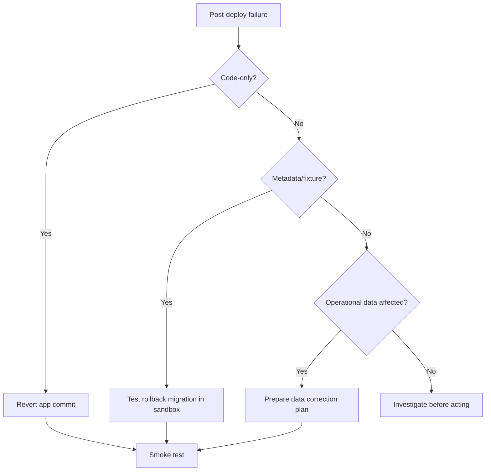

# Rollback Runbook

Rollback planning is part of release planning. Do not deploy a risky InductOne change without knowing how to back it out.

## Rollback categories

### Code-only rollback

Use when:

- Python behavior changed.
- No schema/fixture migration changed persisted records.
- Failure is caused by runtime behavior.

Rollback:

1. Revert to prior known-good Git commit.
2. Update app on Frappe Cloud.
3. Clear cache.
4. Run post-deploy smoke test.

### Fixture/schema rollback

Use when:

- DocTypes, Client Scripts, Custom DocPerm, Custom Fields, or Property Setters changed.

Rollback is more sensitive because migration may have changed database metadata.

Preferred approach:

1. Restore candidate sandbox.
2. Test rollback commit with `bench migrate`.
3. Confirm metadata returns to expected state.
4. Apply rollback in production only after sandbox evidence.

### Operational data rollback

Use when:

- Production records were mutated incorrectly.
- Generated artifacts or uploaded files were created incorrectly.

This is not a Git rollback. It requires a data correction plan.

Preferred approach:

1. Stop further use of affected workflow.
2. Identify affected records.
3. Determine whether correction can be done through supported UI/actions.
4. If direct database repair is required, prepare and test in restored sandbox.
5. Preserve audit trail.

## Backups

Before risky release:

- Confirm recent Frappe Cloud database backup exists.
- Confirm public/private files backup exists if file-generation workflows are affected.
- Know how to restore to a separate site before production rollback is considered.

## Rollback decision tree

## Rollback evidence

Record:

- Failing release commit.
- Symptoms.
- Affected DocTypes/records.
- Rollback commit or data correction action.
- Sandbox validation result.
- Production post-rollback smoke result.

## Do not

- Do not run destructive database commands in production without a tested plan.
- Do not manually delete fixture-managed metadata from production GUI without reconciling the repo.
- Do not assume reverting Git automatically reverts database state.
- Do not silently repair operational records without documenting the reason and affected data.
