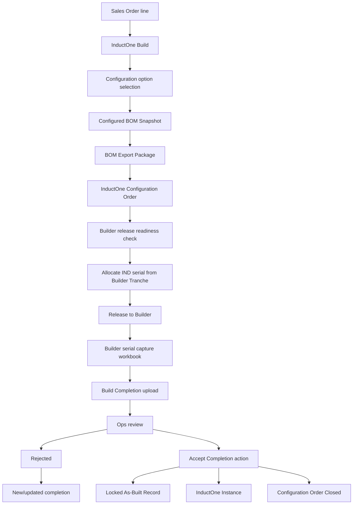
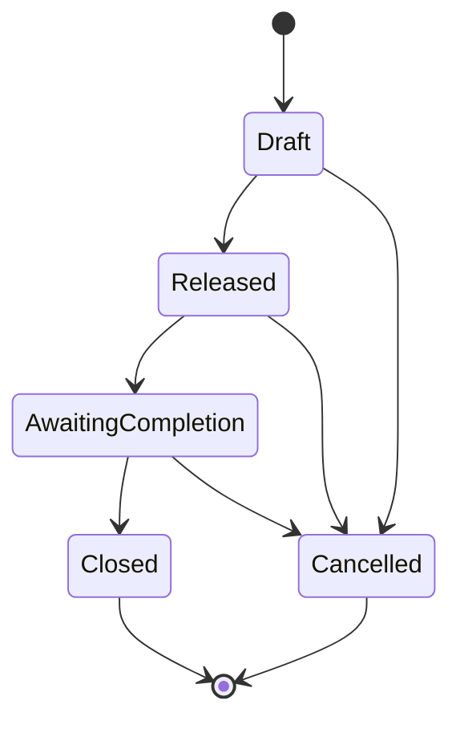
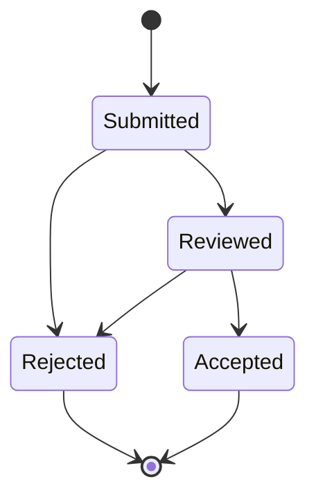
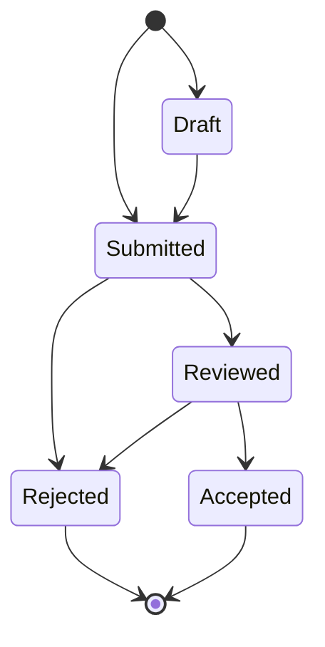
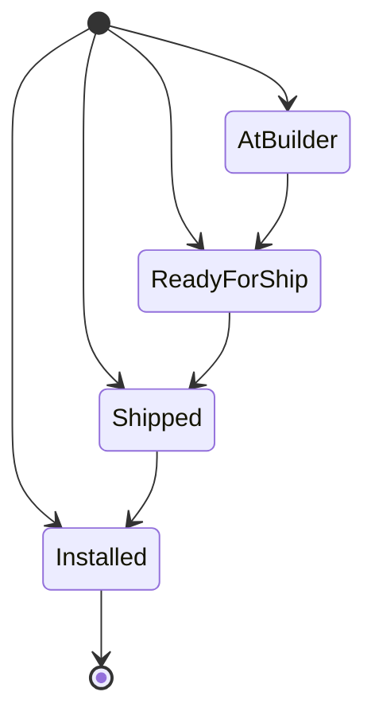

# InductOne Build-to-Instance Workflow

This document describes the intended InductOne operational lifecycle from a Sales Order line through a deployed InductOne Instance.

It is both a workflow explanation and an audit guide. Each state-changing step should have a server-side gate, an audit trail, and a validation test.

## End-to-end flow

## Step 1: Build creation

The workflow starts from a Sales Order line using client-side UI controls. The Build record carries the selected product context and links downstream generated artifacts.

Expected responsibilities:

- UI helps the operator select the correct Sales Order Item.
- Server-side validation should ensure required Build fields exist before downstream actions run.
- Build status should advance only through valid transitions.

Current hardening need:

- Add an explicit server-side InductOne Build lifecycle validator.
- Define the canonical Build status transition table.
- Test that direct API/bench edits cannot skip required gates.

## Step 2: Option selection

Configuration options are loaded and selected on the Build. Existing client scripts enforce group behavior and disable unsupported selection modes.

Expected responsibilities:

- UI presents only active/released or otherwise allowed options.
- Client script should prevent accidental invalid combinations.
- Server-side validation should enforce anything business-critical.

Current hardening need:

- Identify all client-side option selection rules.
- Move any rule that affects released configuration validity into server-side validation.
- Document allowed option states and grouping rules.

## Step 3: Snapshot generation

Configured BOM Snapshot records capture the configured structure at a point in time. Snapshot hierarchy and diff logic is implemented in Python.

Expected responsibilities:

- Snapshot should be deterministic for the same Build/configuration input.
- Snapshot should be immutable or tightly controlled after downstream release.
- Diff reports should compare actual persisted snapshots, not transient UI state.

Current hardening need:

- Define snapshot immutability rules.
- Add snapshot generation tests using known inputs.
- Add smoke tests for hierarchy workbook and diff APIs.

## Step 4: BOM Export Package

BOM Export Package generation creates the builder-facing package artifacts.

Expected responsibilities:

- Package generation must validate required Build, Snapshot, BOM, and Configuration Order links.
- Generated file records should be attached predictably.
- Failure should leave an explicit failure state or throw before partial success is reported.

Current hardening need:

- Review every `frappe.db.commit()` and broad exception path in `bom_export.py`.
- Define transaction ownership for package generation.
- Add a package-generation characterization test.

## Step 5: Configuration Order

InductOne Configuration Order is the formal operational object between configured Build and builder release.

Observed status values:

- `Draft`
- `Released`
- `Awaiting Completion`
- `Closed`
- `Cancelled`

Expected responsibilities:

- CO status should be read-only to normal users and changed through explicit actions.
- CO should know its Build, Snapshot, builder, serial, and generated package references.
- CO close should happen atomically during acceptance.

Current hardening need:

- Add a server-side Configuration Order lifecycle validator.
- Define allowed transitions, for example:

The exact transition names should match the field options. The diagram is a proposed model, not yet a validated final rule.

## Step 6: Serial allocation

Serial allocation is handled through Builder Tranches.

Current server-side controls:

- Tranche start/end sanity.
- `next_serial` range validation.
- No overlapping tranches, including retired tranches.
- Row-level lock during allocation.
- Allocation primitive does not commit; caller owns transaction.

This is a strong design.

Expected responsibilities:

- Allocate exactly one serial per release-intended Build.
- Prevent duplicate serials even under concurrent requests.
- Store allocation audit fields.

Current hardening need:

- Add concurrency test for two simultaneous allocations.
- Add role check around user-facing allocation endpoint.
- Document who can create, edit, activate, retire, or extend tranches.

## Step 7: Builder release

Builder release prepares and/or releases the Build package to a builder.

Expected responsibilities:

- Validate Build readiness.
- Ensure required package artifacts exist.
- Ensure builder supplier is present.
- Ensure serial allocation occurs before release if required by the process.
- Record release and acknowledgement timestamps.

Current hardening need:

- Define release status transitions on Build and CO.
- Ensure release action is the only path that sets release state.
- Add role checks for release endpoints.

## Step 8: Build Completion upload

`create_completion_from_upload` creates an `InductOne Build Completion` from a builder workbook.

Current server behavior:

- Requires `build_name`.
- Requires uploaded file URL.
- Requires Build to have a Configuration Order.
- Requires CO status `Awaiting Completion`.
- Parses workbook before mutating records.
- Validates workbook InductOne serial against Build serial and stores warnings.
- Creates Completion as `Submitted`.
- Copies builder supplier/contact context.
- Populates serial child rows, preserving empty serial rows for review.
- Attaches workbook evidence.
- Updates parent Build completion status.

Current hardening need:

- Apply the candidate-tested Draft lifecycle fix.
- Add integration test for valid workbook upload.
- Add tests for parse failure, serial mismatch warning, missing CO, wrong CO status, and missing uploaded File record.

## Step 9: Build Completion review

Build Completion review is governed by server-side validation.

Current server-side lifecycle:

Candidate-tested correction:

Additional gates:

- `Reviewed` requires at least one serial row.
- `Rejected` requires Review Notes.
- `Accepted` cannot be set directly. It must be set through the acceptance method, which sets an internal flag.

## Step 10: Acceptance

`accept_completion_create_as_built` is the critical atomic operation.

It performs:

1. Validate completion exists and is `Reviewed`.
2. Validate completion has serial rows.
3. Validate completion links to Build and Configuration Order.
4. Validate parent Build does not already have an As-Built Record.
5. Validate parent Build has `system_serial`.
6. Create locked As-Built Record.
7. Copy serial rows with source traceability.
8. Set Completion to `Accepted` through the protected acceptance flag.
9. Update parent Build.
10. Close Configuration Order.
11. Create InductOne Instance.
12. Commit only after all steps succeed.

This is the right transaction shape. It should be treated as one of the highest-value integration tests in the system.

## Step 11: As-Built Record

The As-Built Record is created during acceptance and should be locked as historical evidence.

Expected responsibilities:

- Preserve serials as accepted.
- Preserve source row references from Build Completion.
- Preserve accepted-by and accepted-at audit fields.
- Prevent normal post-acceptance mutation.

Current hardening need:

- Confirm server-side immutability rules exist or add them.
- Confirm permissions prevent non-admin edits.
- Add test for attempted post-lock mutation.

## Step 12: Instance

Instance records represent deployed units for support and lifecycle tracking.

Current server-side Instance lifecycle:

Notes:

- New records may be created in any valid status to support backfill.
- Updates must move forward only.
- System serial must match `IND-####` style.
- `shipped_at` and `installed_at` are stamped automatically on those transitions.

Current hardening need:

- Add tests for valid and invalid transitions.
- Add permission matrix for who can update status.
- Confirm backfill method is restricted.

## Audit checklist for this workflow

For every step above, the handoff owner should be able to answer:

- Which button or UI action starts this step?
- Which whitelisted method or server hook enforces it?
- Which DocType fields are mutated?
- Which roles are allowed?
- What happens if the action fails halfway?
- Is there a transaction boundary?
- Is there an audit timestamp/user?
- Is the behavior covered by a test?

If any answer is unclear, that is a hardening backlog item.
