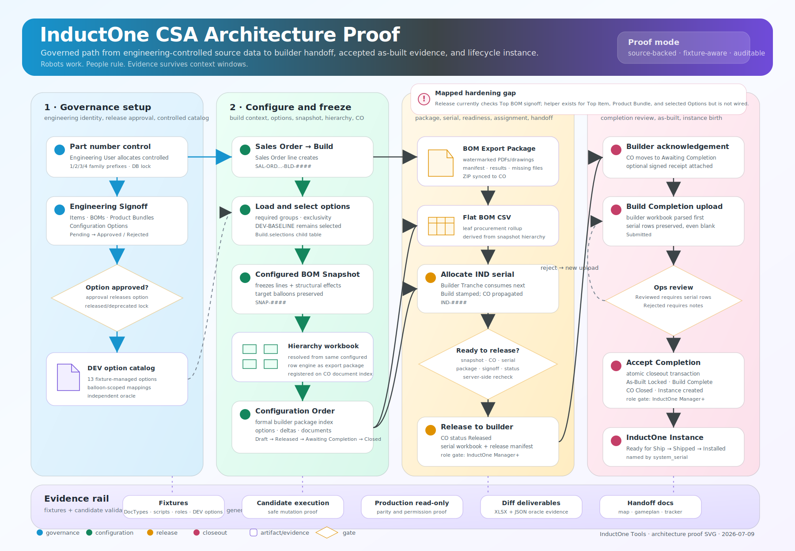
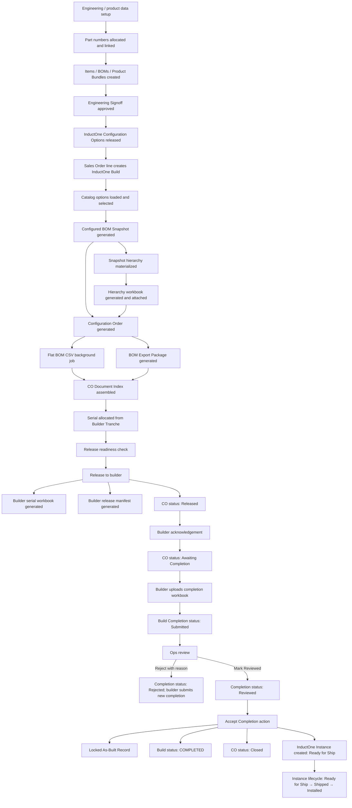
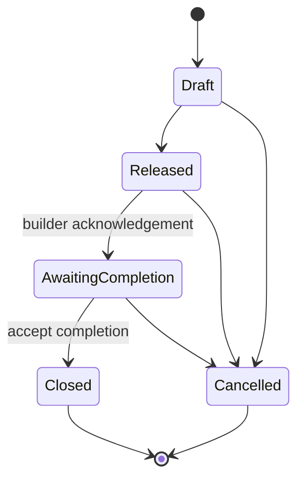
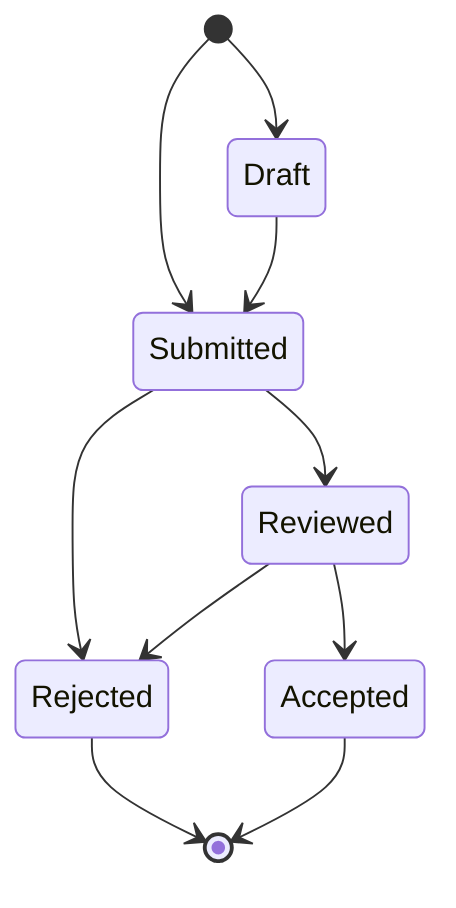
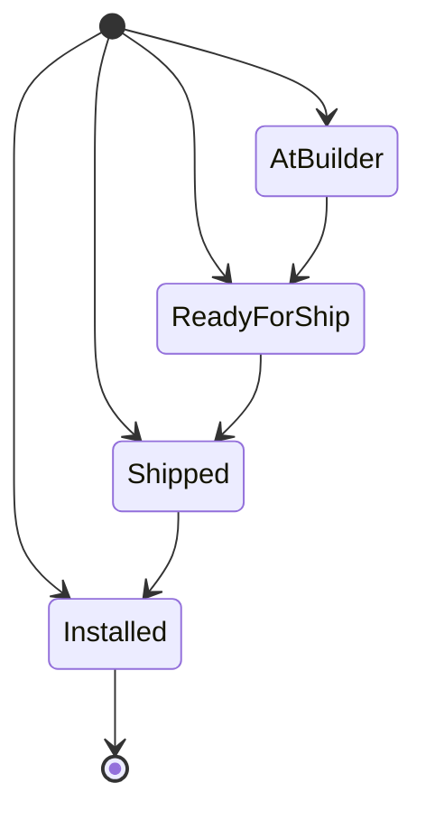

# InductOne CSA End-to-End Architecture Map

Date prepared: 2026-07-09  
Prepared for: InductOne CSA architecture proof / handoff validation  
Source basis: local repository static audit, fixture inventory, and previously generated candidate/production evidence.

This document maps the InductOne CSA workflow as implemented in the `inductone_tools` app. It is intended to be readable by a future owner who did not build the tool, while still being precise enough to audit against code, fixtures, and validation evidence.

## Visual architecture map

The repo-tracked SVG version of this workflow is available at:

## Evidence labels

| Label | Meaning |
|---|---|
| Confirmed by code | Verified in Python or fixture-managed Client Script in this repository. |
| Confirmed by fixture | Verified in fixture-managed DocType, Custom Field, Report, Workspace, Role, Role Profile, or Custom DocPerm JSON. |
| Confirmed by prior validation | Previously validated in candidate and/or production evidence generated during this hardening cycle. |
| Intended / gap | The desired process is visible from code comments or helper functions, but active enforcement is incomplete or not yet proven. |
| Not yet confirmed | Requires candidate execution or GUI validation before it can be treated as true. |

## Source files inspected for this map

| Area | Source |
|---|---|
| Build UI orchestration | `inductone_tools/fixtures/client_script.json` → `InductOne Build Script`, `Sales Order Build Button`, related scripts |
| Release and builder handoff | `inductone_tools/builder_release.py` |
| Serial allocation | `inductone_tools/serial_allocation/release.py`, `inductone_tools/serial_allocation/co_sync.py`, `inductone_tools/serial_allocation/tranche.py` |
| Snapshot hierarchy | `inductone_tools/snapshot/hierarchy.py` |
| Flat BOM generation | `inductone_tools/inductone_tools/configured_bom/flat_bom.py` |
| BOM export package | `inductone_tools/bom_export.py` |
| Completion upload/review | `inductone_tools/build_completion.py`, `inductone_tools/build_completion_workbook_parser.py` |
| Acceptance / As-Built / Instance birth | `inductone_tools/build_completion_accept.py`, `inductone_tools/instance/creation.py`, `inductone_tools/instance/hooks.py` |
| External builder isolation | `inductone_tools/external_builder_permissions.py`, `inductone_tools/hooks.py` |
| Engineering signoff | `inductone_tools/engineering_signoff.py`, `inductone_tools/hooks.py` |
| Part number control | `inductone_tools/part_numbering.py`, `inductone_tools/hooks.py` |
| Option catalog and oracle | `inductone_tools/balloon_scoped_options.py`, `inductone_tools/fixtures/inductone_configuration_option.json` |
| Per-option proof reports | `scripts/run_per_option_snapshot_diff_reports.py`, `docs/evidence/per_option_snapshot_diff_20260708T193821Z`, production evidence copied locally |

## Fixture-managed architecture boundary

The InductOne system is not only Python code. The deployed behavior depends on fixture-managed Frappe records.

Confirmed fixture-managed record groups:

| Fixture | Count observed locally | Purpose |
|---|---:|---|
| `doctype.json` | 31 | Custom DocTypes and child tables for builds, snapshots, release, completion, As-Built, instance, signoff, part numbering, fixture control. |
| `custom_field.json` | 7 | BOM Item and snapshot structural effect fields, including balloon/user-note metadata. |
| `client_script.json` | 26 | Desk buttons and UI orchestration for build creation, option loading, snapshot generation, release, completion, signoff, and related UI. |
| `custom_docperm.json` | 138 | Curated role permissions. |
| `inductone_configuration_option.json` | 13 | Reviewed `DEV-%` configuration options. |
| `report.json` | 1 | `Electrical Balloon Callouts`. |
| `workspace.json` | 1 | `Operations` workspace. |
| `wiki_page.json` | 3 | Role/workflow documentation pages. |

This means the governed deployment unit is the app repository plus the fixture set. Manual GUI-only changes are not sufficient for durable production behavior.

## High-level workflow

## Phase 0: upstream governance before a CSA build

### Part number control

Confirmed by code:

- `allocate_numbers()` in `part_numbering.py` is explicitly gated to `Engineering User`, `InductOne Process Architect`, or `System Manager`.
- Controlled number families are:
  - `Part` → prefix `1`
  - `Assembly` → prefix `2`
  - `Software` → prefix `3`
  - `Service` → prefix `4`
- Allocation uses a MariaDB named lock (`part_number_allocation_global_sequence`) so concurrent allocations cannot intentionally consume the same sequence.
- `Part Number Assignment` is created as `Reserved`.
- `Part Number Allocation Request` is updated to `Allocated`.
- `Item.validate` enforces controlled-number linkage:
  - controlled numeric item code must match a `Part Number Assignment`;
  - family must match prefix;
  - cancelled/superseded assignments cannot be used;
  - a GitLab EC URL is required before controlled Item creation/release.
- `Item.after_insert` / `Item.on_update` releases the matching assignment and links it back to the Item.
- `Product Bundle.validate` enforces that controlled Product Bundles use Assembly-controlled parent Items.

Architectural role:

Part numbering is not just bookkeeping. It is the upstream identity control for Items and Assemblies that later appear in BOMs, snapshots, export packages, and builder-facing artifacts.

### Engineering signoff control

Confirmed by code:

- Signoff-enabled target doctypes:
  - `BOM`
  - `Product Bundle`
  - `Item`
  - `InductOne Configuration Option`
- `BOM`, `Product Bundle`, and `Item` auto-create a pending signoff on insert.
- Configuration Options are intentionally excluded from auto-create; their signoff is requested manually when the option is ready for review.
- `approve_signoff()`, `reject_signoff()`, and `supersede_config_option()` are explicitly gated to `Engineering User`, `InductOne Process Architect`, or `System Manager`.
- Approval requires the signoff to be `Pending` and current.
- Reject requires a reason.
- For `InductOne Configuration Option`, approval is the release action:
  - approval sets the option status to `Released`;
  - released/deprecated options are locked by `on_target_save`;
  - revision requires `supersede_config_option()`, which clones a new Draft and marks the original Deprecated.

Architectural role:

Engineering signoff is the quality gate before build-driving records are treated as usable in the production CSA workflow.

### Configuration option catalog

Confirmed by code and fixture:

- The `DEV-%` option catalog is repo-managed in `inductone_tools/fixtures/inductone_configuration_option.json`.
- The executable catalog/oracle lives in `inductone_tools/balloon_scoped_options.py`.
- There are 13 fixture-managed DEV options:
  - `DEV-BASELINE`
  - `DEV-PANEL-MCP-STD`
  - `DEV-PANEL-MCP`
  - `DEV-PANEL-IPC-STD`
  - `DEV-PANEL-IPC`
  - `DEV-COMP-HMI-STD`
  - `DEV-COMP-HMI`
  - `DEV-COMP-STACK-STD`
  - `DEV-COMP-STACK`
  - `DEV-COMP-FORTRESS-STD`
  - `DEV-COMP-FORTRESS`
  - `DEV-COMP-MAGLOCK-STD`
  - `DEV-COMP-MAGLOCK`
- `DEV-BASELINE` suppresses the unused option rows in the 150% master.
- Relocation options apply balloon-scoped substitutions/additions.
- The oracle function `expected_resolution()` independently calculates the expected configured result and flat collision totals.

Confirmed by prior validation:

- Candidate and production per-option snapshot diff outputs semantically matched for all seven review deviations on 2026-07-08.
- Production evidence was generated from the deployed site and compared locally to candidate evidence with zero semantic mismatches.

## Phase 1: Sales Order to InductOne Build

### Sales Order build creation

Confirmed by fixture-managed Client Script:

- `Sales Order Build Button` creates an `InductOne Build` from a Sales Order context.
- Build autoname format is `format:{sales_order}-BLD-{####}`.

Confirmed by fixture:

Key `InductOne Build` fields:

| Field | Purpose |
|---|---|
| `sales_order` | Source Sales Order. |
| `sales_order_item_row_name` | Source Sales Order Item row reference. |
| `customer_project_label` | Human project context. |
| `top_item` | Parent configured item. |
| `top_bom` | Source top BOM. |
| `orientation` | Right-Hand / Left-Hand. |
| `builder_supplier` | Supplier who will build the unit. |
| `builder_poc` | Builder point of contact. |
| `builder_purchase_order` | Builder PO, if used. |
| `system_serial` | Allocated `IND-####` serial. |
| `builder_tranche` | Source tranche that allocated the serial. |
| `selections` | Child table of option selections. |
| `latest_snapshot` / `selected_snapshot` | Generated/winner configured snapshot. |
| `latest_config_order` | Generated Configuration Order. |
| `latest_bom_export_package` | Generated package for builder documentation. |
| `latest_build_completion` | Latest returned builder completion record. |
| `as_built_record` | Accepted locked As-Built Record. |
| `build_status` | `DRAFT`, `READY`, `RELEASED_TO_BUILDER`, `SUPERSEDED`, `COMPLETED`. |

Intended / gap:

- No server-side `InductOne Build` lifecycle validator was found in the audited Python. Current status control appears to be mostly UI/method-driven. A validation plan should explicitly test direct status edits and either confirm permissions are sufficient or add a server-side transition validator.

## Phase 2: option selection and snapshot generation

### Catalog loading and option group validation

Confirmed by fixture-managed Client Script:

- `InductOne Build Script` loads catalog options from `InductOne Configuration Option`.
- It fetches active usable options and populates `InductOne Build Option Selection` rows.
- It enforces option group mutual exclusivity in the selection table.
- It validates required groups before snapshot, Configuration Order, handoff, or release.
- `DEV-BASELINE` is part of the required group model and should remain selected as the standard baseline layer. Relocation options layer on top of that baseline rather than replacing the existence of the baseline group.

Confirmed by fixture:

`InductOne Build Option Selection` stores:

| Field | Purpose |
|---|---|
| `option` | Link to `InductOne Configuration Option`. |
| `option_code`, `option_name`, `option_category`, `option_group` | Frozen display / grouping metadata. |
| `selected` | Whether this option is selected for the build. |
| `parameter_value`, `notes` | Extra parameter/comment space. |

Intended / gap:

- Required option group validation is currently implemented in the client script. Because release server-side calls `check_builder_release_readiness()`, but the readiness function does not itself re-run full option group completeness, candidate validation should test whether direct API release can bypass required-group completeness.

### Configured BOM Snapshot generation

Confirmed by fixture-managed Client Script:

- `por_generate_snapshot_from_build()`:
  - requires `builder_supplier`;
  - runs option group validation;
  - gathers selected options;
  - resolves option actions into snapshot `lines` and `structural_effects`;
  - inserts a `Configured BOM Snapshot`;
  - calls `inductone_tools.snapshot.hierarchy.populate_snapshot_hierarchy`;
  - calls `inductone_tools.snapshot.hierarchy.generate_hierarchy_workbook`;
  - updates the Build with `latest_snapshot` and `snapshot_rev`.

Confirmed by fixture:

`Configured BOM Snapshot` stores:

| Child table / field | Purpose |
|---|---|
| `lines` | Flat included/excluded item membership/audit table. Not the final hierarchy source of truth. |
| `structural_effects` | Frozen option effects, including action, effect mode, target item/BOM, target balloon, replacement item/BOM, source option code, quantity, and reason. |
| `hierarchy` | Materialized resolved tree produced by `snapshot.hierarchy`. |
| `delta_lines` | Configuration Order delta display rows. |

Confirmed by code:

- `populate_snapshot_hierarchy()` uses `bom_export.build_configured_rows()` through an in-memory `BOM Export Package` stub.
- It wipes/replaces existing hierarchy rows to remain idempotent.
- It enriches hierarchy rows with frozen Item metadata.
- It persists source BOM, source BOM Item, balloon numbers, electrical unit, electrical revision, and user notes.
- `generate_hierarchy_workbook()` renders an XLSX, attaches it to the snapshot, and registers it in the linked Configuration Order document index if a CO can be resolved.

Architectural invariant:

The configured hierarchy workbook and configured export package use the same resolver path. The snapshot `lines` table is not the structural authority for final configured rows.

## Phase 3: Configuration Order

### Configuration Order generation

Confirmed by fixture-managed Client Script:

- `por_generate_configuration_order()`:
  - requires `builder_supplier`;
  - validates required option groups;
  - uses `selected_snapshot` or `latest_snapshot`;
  - generates a snapshot if none exists;
  - validates the snapshot belongs to the Build;
  - creates an `InductOne Configuration Order`;
  - copies Build context: Build, Sales Order, builder, top item, top BOM, orientation, customer/project label;
  - stamps `system_serial` and `builder_tranche` if already allocated on the Build;
  - copies selected options and their builder descriptions;
  - copies snapshot delta lines;
  - seeds a BOM Export Package document-index row if one already exists;
  - sets Build `latest_config_order`;
  - links an existing BOM Export Package back to the new CO if applicable;
  - syncs the hierarchy workbook into the CO document index.

Confirmed by fixture:

`InductOne Configuration Order` status values:

The above state model reflects the observed implementation paths. A server-side CO transition validator was not found in the audited Python.

### Flat BOM CSV

Confirmed by code:

- `InductOne Configuration Order.after_insert` enqueues `build_and_attach_flat_bom_for_config_order()`.
- The flat BOM generation reads the linked snapshot.
- It walks `snapshot.hierarchy`, includes leaf nodes only, multiplies quantities down the parent chain, rolls identical leaf item codes into procurement totals, renders CSV, attaches it to the CO, and adds/updates a required document-index row.

Architectural invariant:

Flat BOM CSV is a pure function of frozen `snapshot.hierarchy`. It should not diverge from the hierarchy workbook.

## Phase 4: BOM Export Package and builder package documents

### BOM Export Package generation

Confirmed by code:

- `generate_now(package_name)` is the synchronous package-generation endpoint.
- It validates that at least one file type is selected.
- In `Configured Build` mode it requires:
  - `inductone_build`;
  - `configuration_order`;
  - `configured_snapshot`;
  - `bom`.
- It resolves configured rows via `build_configured_rows()`.
- It collects Item/BOM attachments by requested file extensions.
- It writes package result rows and missing-file summary.
- It builds a ZIP that includes:
  - matched drawing/PDF/STEP/DXF/STL payloads;
  - `manifest.txt`;
  - generated result/missing CSVs.
- PDFs are watermarked where dependencies are available.
- It attaches the ZIP to the `BOM Export Package`.
- It sets package `status` to `Complete` or `Failed`.
- It calls `sync_package_into_configuration_order()`.

Confirmed by code:

`sync_package_into_configuration_order()`:

- stamps `co.bom_export_package`;
- adds/updates a required CO document-index row titled `Configured BOM Export Package - {package}`;
- records the package ZIP URL and status note.

Architectural role:

The BOM Export Package is the builder-facing part-documentation payload. For cable-only DEV option deviations, previous validation distinguished this stable part-document payload from configuration-derived documents such as the hierarchy workbook and Configuration Order, which are expected to vary by configuration.

## Phase 5: serial allocation and release gate

### Builder Tranche allocation

Confirmed by code:

- `validate_tranche()` enforces:
  - builder supplier required;
  - start/end range sanity;
  - next serial within range;
  - no overlapping tranches, including retired tranches.
- `allocate_next_serial()`:
  - locks active tranche rows with `FOR UPDATE`;
  - picks the first active non-exhausted tranche for the builder supplier;
  - formats serials as `IND-####`;
  - increments `next_serial`;
  - stamps allocation count and last allocation user/time;
  - returns serial, serial integer, and tranche name.

Confirmed by code:

- `allocate_serial_for_build(build_name)`:
  - is idempotent if the Build already has `system_serial`;
  - requires `builder_supplier`;
  - blocks released/superseded/completed builds;
  - stamps Build `system_serial`, `builder_tranche`, `serial_allocated_at`, `serial_allocated_by`;
  - propagates the serial to existing Configuration Orders for the Build.

Confirmed by code:

- `assert_co_has_serial(co_name)` is called during release:
  - passes if the CO already has `system_serial`;
  - self-heals by stamping CO from Build if Build has serial but CO does not;
  - throws if neither CO nor Build has a serial.

Intended / gap:

- `allocate_serial_for_build()` is whitelisted and state-changing. In the inspected function body, no explicit role check was found. It may be protected by DocPerm/UI availability, but the validation plan should include direct method negative tests for unauthorized users.

### Release readiness

Confirmed by code:

`check_builder_release_readiness(build_name)` is read-only and checks:

| Requirement | Failure behavior |
|---|---|
| Build exists | Throws if missing name / load failure. |
| `builder_supplier` exists | Missing item. |
| `top_item` exists | Missing item. |
| `top_bom` exists | Missing item. |
| `system_serial` allocated | Missing item. |
| snapshot exists | Missing item. |
| Configuration Order exists | Missing item. |
| CO loads | Missing item if not loadable. |
| CO snapshot matches Build snapshot | Missing item if mismatched. |
| Build/CO serials do not conflict | Missing item if both exist and differ; warning if CO blank but Build has serial. |
| CO status | Warning if status is not `Draft` or `Released`. |
| BOM Export Package exists | Missing item. |
| BOM Export Package has `output_zip` | Missing item. |
| Package status `Complete` | Warning if not complete. |
| Flat BOM linked | Warning if missing. |
| Build already released | Warning. |
| Top BOM Engineering Signoff approved | Missing item if not approved. |

Important gap found:

`builder_release.py` also contains `_append_engineering_signoff_readiness_checks()`, which is intended to require approved signoffs for:

- Top BOM;
- Top Item;
- Product Bundle for Top Item;
- every selected Configuration Option on the Configuration Order.

However, that helper was not called anywhere in the inspected file. The active readiness path currently checks only Top BOM signoff. This should be treated as a release-gate hardening gap until fixed and validated.

### Release to builder

Confirmed by code:

- `release_to_builder_now()` is explicitly gated to `InductOne Manager`, `InductOne Process Architect`, or `System Manager`.
- It re-runs readiness server-side.
- It requires CO serial via `assert_co_has_serial()`.
- It generates the builder serial capture workbook first.
- It generates the builder release manifest.
- It stamps Build release fields:
  - `build_status = RELEASED_TO_BUILDER`;
  - `released_at`;
  - `released_by`;
  - `builder_release_status = Released`;
  - release note fields;
  - `as_built_status = Pending Builder Submission` if present.
- It stamps linked CO `co_status = Released`.

Confirmed by code:

`generate_required_serial_capture_artifact()`:

- creates a per-build workbook from repo-controlled `builder_templates/OPS-BLD-F01_Template.xlsx`;
- pre-fills:
  - InductOne Serial Number (`IND-####`);
  - Build Date;
  - Builder Organization;
  - Builder Point of Contact;
  - Builder Point of Contact Email;
  - Instructions sheet release context: Build, CO, Snapshot, Top BOM.
- attaches the workbook privately to the Build.
- adds/updates a CO document-index row `Builder Serial Capture Workbook - {build}`.

Confirmed by code:

`generate_builder_release_bundle()`:

- creates a lightweight builder release manifest instead of a giant nested ZIP.
- ensures CO document index contains:
  - BOM Export Package ZIP;
  - Flat BOM CSV;
  - Builder Release Manifest.
- stamps Build bundle/manifest fields.

Intended / gap:

- `generate_builder_release_bundle()` is whitelisted and state-changing but does not itself call `_require_release_role()`. It is called by the role-gated release method, but direct method negative tests should confirm unauthorized callers cannot use it independently or it should be gated directly.

## Phase 6: builder assignment and external access boundary

Confirmed by code:

External builder isolation is enforced through `external_builder_permissions.py` and `hooks.py`:

| Doctype | External builder behavior |
|---|---|
| `Item` | Raw access denied by query condition and `has_permission`. |
| `BOM` | Raw access denied by query condition and `has_permission`. |
| `InductOne Configuration Order` | Scoped by `builder_supplier` matching Supplier User Permission. |
| `BOM Export Package` | Scoped by `builder_supplier`. |
| `InductOne Build Completion` | Scoped by `builder_supplier`. |
| `Configured BOM Snapshot` | Visible only if linked through a scoped CO or BOM Export Package. |

Architectural rule:

External builders receive generated handoff artifacts and scoped records. They are not supposed to browse live Items, BOMs, Sales Orders, or unrelated internal records.

## Phase 7: acknowledgement and completion upload

### Builder acknowledgement

Confirmed by code:

- `acknowledge_builder_release(build_name, acknowledgement_file_url=None, note=None)`:
  - requires linked Configuration Order;
  - requires CO status `Released` or `Awaiting Completion`;
  - sets `co_status = Awaiting Completion`;
  - stamps acknowledgement user/time;
  - optionally stores acknowledgement file;
  - optionally adds CO document-index row `Builder acknowledgement - {build}`.

Intended / gap:

- The method is whitelisted and state-changing. No explicit role check was found in the audited function. This should be covered by direct method negative tests or gated directly.

### Builder completion upload

Confirmed by fixture-managed Client Script:

- The Build form exposes an upload dialog for the returned builder workbook.
- It calls `inductone_tools.build_completion.create_completion_from_upload`.

Confirmed by code:

`create_completion_from_upload()`:

- requires `build_name`;
- requires uploaded file URL;
- requires Build `latest_config_order`;
- requires linked CO status `Awaiting Completion`;
- reads and parses the workbook before creating records;
- validates workbook `IND` serial against Build `system_serial`;
- treats serial mismatches as non-fatal warnings stored in completion notes;
- creates `InductOne Build Completion` with `status = Submitted`;
- copies Build/CO/snapshot/builder context;
- populates one child serial row per workbook component label, including empty serial values so missing entries are visible during review;
- attaches the uploaded workbook to the completion record;
- updates Build `latest_build_completion` and `completion_status = Submitted`;
- commits.

Intended / gap:

- `create_completion_from_upload()` is whitelisted and state-changing. No explicit role check was found in the audited function. The desired access model says external builders may upload their workbook when scoped to their supplier; internal managers may also upload. This should be tested directly, including unauthorized internal read-only roles.

## Phase 8: completion review and acceptance

### Completion state machine

Confirmed by code:

`validate_build_completion()` is wired in `hooks.py` under `InductOne Build Completion.validate`.

Allowed transitions:

Server-side requirements:

| Target status | Requirement |
|---|---|
| `Reviewed` | At least one serial row. |
| `Rejected` | Review Notes required. |
| `Accepted` | Cannot be set directly; only allowed when `frappe.flags.io_acceptance_in_progress` is set by the canonical acceptance method. |

### Acceptance

Confirmed by code:

`accept_completion_create_as_built()` is explicitly gated to `InductOne Manager`, `InductOne Process Architect`, or `System Manager`.

It performs one atomic operation:

1. Requires Completion status `Reviewed`.
2. Requires at least one serial row.
3. Requires parent Build link.
4. Requires Configuration Order link.
5. Requires parent Build has no existing As-Built Record.
6. Requires parent Build has `system_serial`.
7. Creates an `InductOne As-Built Record`.
8. Copies Build, CO, Completion, Snapshot, Builder, and system serial context.
9. Sets As-Built status `Locked`.
10. Copies completion serial rows with `source_completion_row` traceability.
11. Sets Completion status `Accepted` through the internal acceptance flag.
12. Updates Build:
    - `as_built_record`;
    - `completion_status = Accepted`;
    - `completed_at`;
    - `latest_build_completion`;
    - `build_status = COMPLETED`.
13. Sets CO `co_status = Closed`.
14. Creates the `InductOne Instance`.
15. Commits only after all steps succeed.

Architectural invariant:

Acceptance must never be partially complete. As-Built creation, Completion acceptance, Build completion, CO close, and Instance creation are one transaction.

## Phase 9: As-Built and Instance lifecycle

### As-Built Record

Confirmed by fixture:

`InductOne As-Built Record` stores:

- Build;
- Configuration Order;
- Build Completion;
- Configured Snapshot;
- status (`Draft`, `Locked`);
- created/accepted user/time;
- builder supplier;
- system serial;
- child serials with source completion row traceability.

Intended / gap:

- The acceptance method creates As-Built as `Locked`.
- No separate As-Built server-side immutability validator was found in this audit. Permissions may prevent ordinary edits, but post-lock mutation should be tested directly or guarded.

### Instance creation

Confirmed by code:

`create_instance_from_as_built()`:

- requires locked As-Built;
- requires no existing Instance for that As-Built;
- requires source Build `system_serial`;
- resolves builder tranche for the serial;
- creates `InductOne Instance` named by `system_serial`;
- starts status as `Ready for Ship`;
- links Build, As-Built, CO, builder, Sales Order, customer, orientation, and top item;
- copies a text configuration summary from selected Build options.

Confirmed by code:

`validate_instance()` enforces:

- serial format starts `IND-` and suffix is numeric;
- status is one of `At Builder`, `Ready for Ship`, `Shipped`, `Installed`;
- updates move forward only:

- `shipped_at` is stamped on transition to `Shipped`;
- `installed_at` is stamped on transition to `Installed`.

## Artifact register

| Artifact / record | Created by | Stored on | Purpose | Builder-visible? |
|---|---|---|---|---|
| `InductOne Build` | Sales Order client script | DocType | Operational root for one configured unit/build. | No raw Build access currently not listed as external-scoped; builder sees downstream scoped artifacts. |
| `InductOne Build Option Selection` | Load catalog / user selection | Build child table | Per-build selected options and grouping state. | Indirectly through CO selected options. |
| `Configured BOM Snapshot` | Build client script | DocType | Frozen configured structure basis. | Scoped if linked to builder's CO/package. |
| Snapshot `structural_effects` | Build client script | Snapshot child table | Frozen option action effects, including target balloon. | Indirect evidence, potentially visible through snapshot scope. |
| Snapshot `hierarchy` | `populate_snapshot_hierarchy()` | Snapshot child table | Frozen resolved tree; structural source of truth. | Indirectly through workbook/snapshot. |
| Configured BOM Hierarchy Workbook | `generate_hierarchy_workbook()` | Private File attached to Snapshot, CO document index | Builder/reviewer-readable hierarchy with balloon/electrical/user-note columns. | Yes, via CO document package. |
| `InductOne Configuration Order` | Build client script | DocType | Formal builder handoff/order object and package index. | Yes, supplier-scoped. |
| Flat BOM CSV | CO `after_insert` background job | Private File attached to CO, CO document index | Rolled-up procurement/leaf BOM from snapshot hierarchy. | Yes, if in CO package. |
| `BOM Export Package` | Build client script + `bom_export.generate_now()` | DocType + private ZIP | Part-documentation ZIP and missing/results evidence. | Yes, supplier-scoped. |
| BOM Export Package ZIP | `bom_export.generate_now()` | Private File attached to package | PDFs/drawings/manifest/results/missing files. | Yes. |
| Builder Serial Capture Workbook | `generate_required_serial_capture_artifact()` during release | Private File attached to Build, CO document index | Builder returns component serials; prefilled with InductOne serial and release context. | Yes. |
| Builder Release Manifest | `generate_builder_release_bundle()` | Private File attached to Build, CO document index | Machine audit of release artifacts and identifiers. | Yes, via CO package index. |
| Builder acknowledgement | `acknowledge_builder_release()` | CO fields + optional private File + document index row | Evidence builder received package. | Yes/recorded against scoped CO. |
| `InductOne Build Completion` | `create_completion_from_upload()` | DocType | Returned builder workbook parsed into serial rows for review. | Yes, supplier-scoped. |
| Uploaded completion workbook | Upload dialog / completion creation | Private File attached to Completion | Original builder return evidence. | Yes to scoped builder/internal. |
| `InductOne As-Built Record` | `accept_completion_create_as_built()` | DocType | Locked accepted serial record. | Internal primary audit artifact. |
| `InductOne Instance` | `create_instance_from_as_built()` | DocType | Lifecycle/support identity of physical unit. | Internal lifecycle artifact. |

## Gatekeeper matrix

| Gate | Active enforcement source | Authorized / intended actors | Notes |
|---|---|---|---|
| Allocate part numbers | Explicit method role gate | `Engineering User`, `InductOne Process Architect`, `System Manager` | Uses DB lock and controlled family prefixes. |
| Create controlled Item | `Item.validate` | Users with Item create/write plus valid assignment | Requires GitLab EC URL and assignment match. |
| Product Bundle control | `Product Bundle.validate` | Users with Product Bundle write | Requires Assembly-controlled parent Item assignment. |
| Request signoff | Target validation; no explicit role gate found in inspected method | Not yet confirmed | Should be validated against intended users. |
| Approve/reject signoff | Explicit method role gate | `Engineering User`, `InductOne Process Architect`, `System Manager` | Option approval releases option. |
| Supersede option | Explicit method role gate | `Engineering User`, `InductOne Process Architect`, `System Manager` | Released/Deprecated options immutable otherwise. |
| Load options | Client script | Trained Build users | Client-side; no server validation found. |
| Generate snapshot | Client script plus server hierarchy generation | Trained Build users | Critical option group validation is client-side. |
| Generate Configuration Order | Client script; CO `after_insert` flat-BOM job | Trained Build users | CO transition validator not found. |
| Generate BOM Export Package | Whitelisted package method + DocPerm/UI | Trained Build users | Direct method authorization should be tested. |
| Allocate Build serial | Whitelisted method + tranche validation | Intended `InductOne Manager` / architect / system manager | Explicit role gate not found in method body. |
| Release readiness | Read-only whitelisted method | Internal release users | Active signoff check only Top BOM; richer helper not wired. |
| Release to builder | Explicit method role gate | `InductOne Manager`, `InductOne Process Architect`, `System Manager` | Re-checks readiness and CO serial. |
| Prepare builder manifest | Whitelisted method | Intended release users | Explicit role gate not found in method body. |
| Acknowledge builder release | Whitelisted method | Intended internal process manager | Explicit role gate not found in method body. |
| Upload builder completion | Whitelisted method + CO status requirement | Intended external builder or internal process user | Explicit role gate not found; supplier scoping applies to records. |
| Mark completion reviewed/rejected | `Build Completion.validate` | Users with write permission | Reviewed requires serial rows; Rejected requires notes. |
| Accept completion | Explicit method role gate | `InductOne Manager`, `InductOne Process Architect`, `System Manager` | Atomic As-Built/Build/CO/Instance transaction. |
| Instance status updates | `InductOne Instance.validate` | Users with write permission | Forward-only status transitions. |

## Known architecture gaps to validate or harden next

These are findings from the code map, not production incidents.

1. **Release signoff breadth gap**
   - Active readiness checks Top BOM signoff.
   - A richer helper exists for Top BOM, Top Item, Product Bundle, and selected Configuration Options but is not wired.
   - Recommended next action: wire it into `check_builder_release_readiness()` and validate with direct method and GUI smoke tests.

2. **State-changing whitelisted methods without explicit role gates**
   - `allocate_serial_for_build()`
   - `generate_builder_release_bundle()`
   - `acknowledge_builder_release()`
   - `create_completion_from_upload()`
   - possibly `request_signoff()`
   - Recommended next action: classify each as intentionally public-with-DocPerm, external-builder allowed, or needing explicit role gate; then add negative API tests.

3. **Client-side-only option completeness**
   - Required option group validation is clearly implemented in the Build client script.
   - Recommended next action: add server-side validation or prove all state-changing server endpoints cannot be reached with incomplete selections.

4. **Build and CO lifecycle validators not confirmed**
   - Build and CO statuses are advanced by controlled methods/scripts.
   - No general server-side transition validator was found for those doctypes.
   - Recommended next action: add direct write tests and decide whether a validator is needed.

5. **As-Built post-lock immutability not confirmed**
   - Acceptance creates As-Built as `Locked`.
   - No separate As-Built validate hook was found.
   - Recommended next action: test ordinary users cannot edit locked As-Built data; add a validator if permissions are insufficient.

## Current proof strengths

The system has several strong architecture properties already:

- The deployed app is versioned (`3.0.0`) and fixture-managed across DocTypes, fields, roles, permissions, reports, workspace, client scripts, and option catalog.
- Engineering signoff and part numbering are server-side controlled.
- Configuration option release is signoff-driven and immutable after release.
- Snapshot hierarchy, hierarchy workbook, flat BOM, BOM Export configured rows, and per-option diff evidence share the same resolver lineage.
- Serial allocation uses tranche validation and row-level DB locking.
- Release is server-side gated, serial-aware, and artifact-indexed through the Configuration Order.
- Completion acceptance is atomic across Completion, As-Built, Build, CO, and Instance.
- External builders are intentionally isolated from raw Item/BOM access and scoped to supplier-linked generated artifacts.
