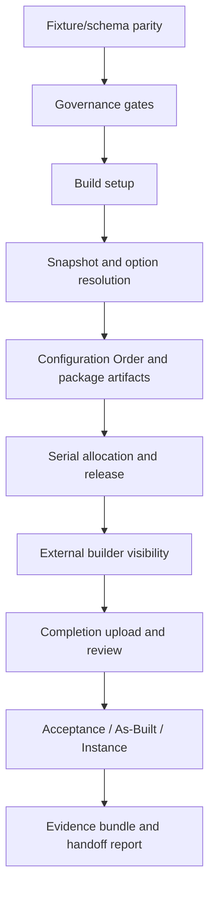

# InductOne CSA Validation Gameplan

Date prepared: 2026-07-09  
Depends on: `docs/workflows/inductone-csa-end-to-end-architecture-map.md`

This gameplan turns the architecture map into executable validation coverage. It is intentionally written after the map so the tests prove the workflow we actually traced, rather than chasing whatever bug or artifact is loudest on a given day.

## Validation principles

1. **Candidate first for mutations.** Any create/submit/release/acceptance test runs only in candidate.
2. **Production read-only.** Production may be queried for parity/evidence, but not mutated by validation scripts unless the system owner explicitly executes a governed production deliverable.
3. **Method-level negative tests matter.** Desk button visibility is not enough; direct API/whitelisted method calls must be tested.
4. **Artifacts must be opened or parsed.** A File URL existing is not enough; generated CSV/XLSX/ZIP evidence should be inspected structurally.
5. **Each gate should fail for the right reason.** A blocked unauthorized user should receive `PermissionError`, not `DoesNotExistError`, silent success, or a domain error after partial mutation.
6. **Every state transition needs both happy-path and bypass tests.**

## Validation lanes

## Lane 1: fixture and schema parity

Purpose: prove the repo-managed deployment state matches what the workflow relies on.

| Check | Environment | Evidence | Pass condition |
|---|---|---|---|
| Fixture JSON parses | Local | Console/evidence text | All fixture JSON files parse. |
| Python compile | Local | Console/evidence text | `python -m compileall inductone_tools scripts` exits 0. |
| DocType inventory | Local fixture | JSON summary | All expected InductOne DocTypes and child tables present in fixture. |
| Custom Field parity | Production read-only before deploy | JSON from custom-field parity checker | Zero unapproved `WOULD_OVERWRITE`. |
| DEV option fixture tracked | Local git | `git show HEAD:...` or staged diff | `inductone_configuration_option.json` is tracked and contains 13 options. |
| Report fixture tracked | Local | Fixture parse | `Electrical Balloon Callouts` report exists in report fixture. |
| Workspace fixture tracked | Local | Fixture parse | `Operations` workspace fixture exists; hidden/deprecated workspaces are intentional. |

## Lane 2: governance gates

Purpose: prove upstream data cannot bypass part numbering or signoff control.

| Gate | Positive persona | Negative persona | Evidence | Pass condition |
|---|---|---|---|---|
| Allocate part numbers | Engineering User | External Builder, Operations Viewer | Candidate method test | Positive succeeds on valid request; negatives raise `PermissionError`. |
| Controlled Item create | Engineering/Operations Manager with valid assignment | Same role without assignment | Candidate execution | Valid item links/releases assignment; missing assignment blocks. |
| Product Bundle control | Operations Manager with Assembly item | User with bad/non-Assembly parent item | Candidate execution | Valid bundle saves; invalid parent blocks. |
| Request signoff | Intended requester, if defined | External Builder | Candidate method test | Must be classified; add role gate if owner wants this restricted. |
| Approve/reject signoff | Engineering User | External Builder, Operations Viewer | Candidate method test | Positive changes status; negatives raise `PermissionError`. |
| Supersede option | Engineering User | External Builder, Operations Viewer | Candidate method test | Positive clones released option to Draft and deprecates original; negatives blocked. |
| Released option immutability | Engineering/User with write permission | Direct save attempt | Candidate execution | Released/Deprecated options cannot be edited except controlled release/supersede flow. |

## Lane 3: Build setup and option selection

Purpose: prove one real CSA build can be configured from Sales Order context without losing required group logic.

| Check | Environment | Evidence | Pass condition |
|---|---|---|---|
| Build created from Sales Order line | Candidate GUI/API | Build record JSON | Build links Sales Order, top item, top BOM, orientation, builder. |
| Catalog load | Candidate GUI/API | Selection rows JSON | Expected active/released options load; no deprecated/draft options unless explicitly allowed. |
| Required group completeness | Candidate GUI + direct API attempt | Failure evidence | Missing required group blocks snapshot/config/release. |
| Mutual exclusivity | Candidate GUI/API | Selection rows before/after | Selecting one option in a group deselects the paired option. |
| Baseline semantics | Candidate | Selection rows | `DEV-BASELINE` remains selected as required baseline layer while deviations layer on top. |

Recommended implementation:

- Add a candidate script that creates or uses a scratch Build, loads catalog rows, toggles each group, and verifies resulting child table state.
- Add a direct method/insert bypass attempt to prove incomplete options cannot reach release-critical server paths.

## Lane 4: snapshot and configured resolver

Purpose: prove configured output is deterministic, balloon-scoped, and consistent across hierarchy/workbook/flat/diff artifacts.

| Check | Environment | Evidence | Pass condition |
|---|---|---|---|
| Snapshot preconditions | Candidate | JSON | Production REV E BOMs present with expected configurable balloon fingerprints. |
| Snapshot generation | Candidate | Snapshot record JSON | Snapshot inserted with lines and structural effects. |
| Structural effects freeze | Candidate | Child table JSON | Every required DEV effect carries `target_balloon`, source option code, effect mode, qty/reason. |
| Hierarchy population | Candidate | Hierarchy rows JSON | Rows materialized; parent links valid; duplicate branches attach by path. |
| Hierarchy workbook | Candidate | XLSX parsed summary | Workbook generated; expected sheets/columns/rows; user notes/balloon/electrical fields present. |
| Flat BOM from hierarchy | Candidate | CSV parsed summary | Leaf rollup equals hierarchy-derived expected totals. |
| Per-option diff | Candidate and production read-only/generated by owner | JSON/XLSX evidence | Each deviation matches oracle; sentinel balloon deltas appear; unchanged balloons do not move. |
| Snapshot diff engine | Candidate | XLSX/JSON diff reports | Hierarchical and Flat Procurement views exist and have expected changed rows. |

Already strong evidence:

- Candidate per-option evidence and production per-option evidence for timestamped runs matched semantically with zero JSON mismatches.

## Lane 5: Configuration Order and document package

Purpose: prove the CO is the formal release packet index and carries all artifacts needed by the builder.

| Check | Environment | Evidence | Pass condition |
|---|---|---|---|
| CO generation | Candidate | CO JSON | Links Build, Sales Order, builder, snapshot, top item/BOM, selected options, deltas. |
| CO serial propagation before release | Candidate | Build/CO JSON | If Build serial exists, new CO receives same serial. |
| Hierarchy workbook in document index | Candidate | CO documents JSON | Required row with hierarchy workbook file URL exists. |
| Flat BOM job | Candidate | CO documents + CSV parse | `flat_bom_status = Complete`, CSV attached and required. |
| BOM Export Package generation | Candidate | Package JSON, ZIP manifest | Status Complete; output ZIP exists; missing summary captured. |
| BOM Export Package synced to CO | Candidate | CO documents JSON | Required `Configured BOM Export Package - ...` row points at ZIP. |
| Package ZIP classification | Candidate | ZIP manifest classification | Part-documentation payload stable where expected; config-derived docs vary where expected. |

## Lane 6: serial allocation and release

Purpose: prove the release gate cannot happen without serial, current snapshot, CO, generated package, and required signoffs.

| Check | Environment | Evidence | Pass condition |
|---|---|---|---|
| Tranche validation | Candidate | Create/update attempts | Invalid overlaps/ranges blocked; valid tranche saves. |
| Serial preview | Candidate | JSON | Next serial returned without mutation. |
| Serial allocation | Candidate | Build + tranche JSON | Build gets `IND-####`, tranche increments, audit fields stamped, COs propagated. |
| Serial idempotency | Candidate | Re-run result | Re-running allocation returns same existing serial without incrementing tranche. |
| Release without serial | Candidate | Method failure JSON | Blocks before artifact generation. |
| Release with mismatched CO serial | Candidate | Method failure JSON | Blocks as data drift. |
| Release readiness full artifacts | Candidate | Readiness JSON | Reports missing/warnings accurately. |
| Release role gate | Candidate | Method negative JSON | Unauthorized users raise `PermissionError`. |
| Release happy path | Candidate | Build/CO/docs JSON | Build `RELEASED_TO_BUILDER`, CO `Released`, workbook + manifest rows present. |

Specific hardening validation from the architecture map:

- Add a test for selected Configuration Options with missing signoffs. Today active readiness checks Top BOM only; once the dormant full helper is wired, this must fail until every selected option is approved.
- Add negative tests for `generate_builder_release_bundle()` direct call.

## Lane 7: external builder visibility

Purpose: prove builders can see generated handoff artifacts but cannot browse live ERPNext source records.

| Persona | Expected can access | Expected cannot access |
|---|---|---|
| `motion.builder@plusonerobotics.com` | Builder Portal, scoped COs, scoped BOM Export Packages, scoped Build Completions, linked scoped snapshots | Raw Item list/records, raw BOM list/records, Sales Orders, unrelated builder records |
| `lam@plusonerobotics.com` | Same as above but Supplier = LAM | Same as above |

Validation:

- GUI smoke: route visibility and create-button visibility.
- Programmatic permission check:
  - `has_permission("Item", read)` false;
  - `has_permission("BOM", read)` false;
  - scoped CO/package/completion records visible only where `builder_supplier` matches User Permission.
- Direct report/list API checks for Item and BOM denial.

## Lane 8: completion upload and review

Purpose: prove builder-returned workbook evidence is parsed, reviewed, and cannot bypass review rules.

| Check | Environment | Evidence | Pass condition |
|---|---|---|---|
| Upload wrong CO status | Candidate | Failure JSON | Blocks unless CO is `Awaiting Completion`. |
| Upload malformed workbook | Candidate | Failure JSON | Fails before creating Completion. |
| Upload valid workbook | Candidate | Completion JSON | Completion created as `Submitted`, file attached, rows parsed. |
| Serial mismatch warning | Candidate | Completion notes | Mismatch is non-fatal but visible in notes. |
| Empty serial cells preserved | Candidate | Completion serial rows | Empty rows exist for reviewer visibility. |
| Reviewed without serial rows | Candidate | Save failure | Blocks. |
| Rejected without notes | Candidate | Save failure | Blocks. |
| Direct Accepted write | Candidate | Save failure | Blocks unless canonical acceptance flag is set. |

Authorization checks to add:

- Positive: scoped external builder can upload only for own supplier, if that remains desired.
- Positive: InductOne Manager can upload internally.
- Negative: Operations Viewer / Finance Viewer cannot upload or mutate completion.

## Lane 9: acceptance, As-Built, and Instance

Purpose: prove the final CSA acceptance is atomic and creates the support/lifecycle record correctly.

| Check | Environment | Evidence | Pass condition |
|---|---|---|---|
| Accept unreviewed completion | Candidate | Failure JSON | Blocks. |
| Accept reviewed completion with no serials | Candidate | Failure JSON | Blocks. |
| Accept build without system serial | Candidate | Failure JSON | Blocks. |
| Accept when Build already has As-Built | Candidate | Failure JSON | Blocks. |
| Accept happy path | Candidate | Linked records JSON | As-Built Locked, Completion Accepted, Build Completed, CO Closed, Instance Ready for Ship. |
| Atomic rollback | Candidate | Forced failure scenario | No partial As-Built/Instance/CO close if later step fails. |
| As-Built post-lock edit | Candidate | Save attempt evidence | Ordinary users cannot alter locked evidence. Add validator if this fails. |
| Instance duplicate As-Built | Candidate | Failure JSON | Second instance for same As-Built blocked. |
| Instance serial format | Candidate | Save attempts | Invalid serial format blocked. |
| Instance status transitions | Candidate | Save attempts | Ready→Shipped→Installed allowed; skips/backwards blocked. |

## Lane 10: deployment and production proof

Purpose: prove production outputs match candidate outputs without mutating production except under owner-governed release steps.

| Check | Environment | Evidence | Pass condition |
|---|---|---|---|
| Backup freshness | Candidate + baseline | JSON | Both restored from expected backup; baseline pristine; candidate migrated. |
| Pre-deploy permission gate | Candidate | JSON/console | Gate PASS with accepted exceptions only. |
| Production post-deploy validator | Production read-only | JSON | All read-only permission checks pass. |
| Production per-option evidence | Production owner-run | JSON/XLSX + local comparison | Oracle PASS; candidate/prod semantic comparison zero mismatch. |
| Version metadata | Production | `bench version` / app metadata | `inductone_tools` reports expected version. |

## Proposed implementation order

1. **Patch known release signoff gap**
   - Wire `_append_engineering_signoff_readiness_checks()` into `check_builder_release_readiness()`.
   - Add direct tests that release blocks when selected Configuration Options lack approved signoff.

2. **Classify and gate whitelisted methods**
   - Decide intended access for:
     - `allocate_serial_for_build`;
     - `generate_builder_release_bundle`;
     - `acknowledge_builder_release`;
     - `create_completion_from_upload`;
     - `request_signoff`.
   - Add explicit role checks where required.
   - Add method negative tests.

3. **Build a candidate end-to-end CSA execution script**
   - Use a scratch or known test Sales Order/Build.
   - Generate snapshot, hierarchy, CO, flat BOM, package, serial, release, acknowledgement, completion, review, acceptance.
   - Write one JSON evidence bundle with every created record and artifact URL.

4. **Build artifact inspectors**
   - Parse hierarchy workbook columns and row counts.
   - Parse flat BOM CSV.
   - Inspect BOM Export ZIP manifest and classify entries.
   - Parse builder serial workbook prefills.

5. **Build direct bypass tests**
   - Direct status edits.
   - Direct whitelisted methods with unauthorized personas.
   - Direct incomplete option selection release attempts.

6. **GUI proof pass**
   - Walk the same flow in Desk as representative personas.
   - Capture screenshots only where they prove something the API cannot show, such as user-facing handoff clarity.

7. **Owner review gate**
   - Present gaps and test results.
   - Only after owner approval, convert hardening findings into implementation patches.

## Final proof packet shape

When complete, the architecture proof packet should contain:

- this gameplan;
- the architecture map;
- one candidate end-to-end evidence JSON;
- artifact inspection JSON for every generated file;
- method negative-test JSON;
- GUI smoke evidence;
- production read-only validation evidence;
- production owner-run per-option evidence comparison;
- a concise sign-off summary stating which gaps remain accepted vs fixed.

