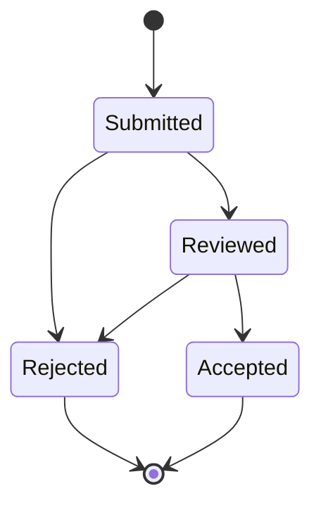
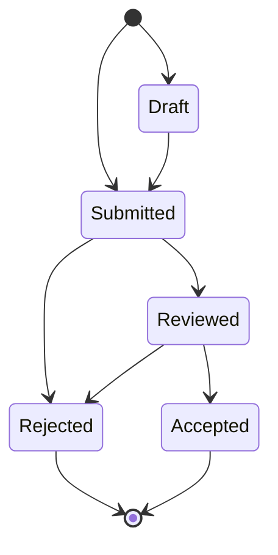
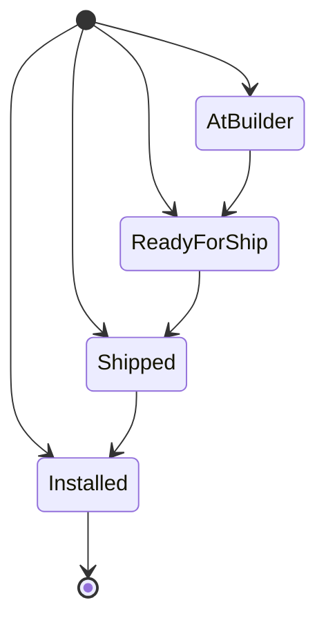
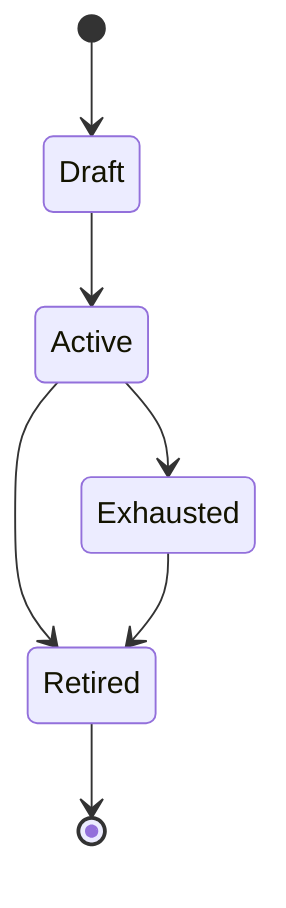
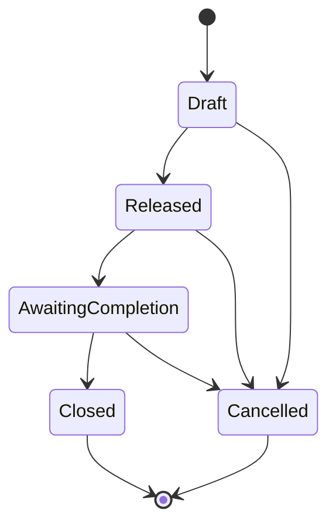
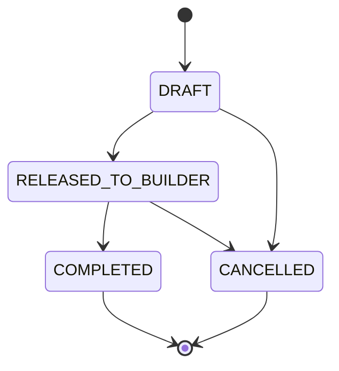

# Lifecycle and State-Machine Reference

This document records the current and proposed lifecycle gates for major InductOne objects.

Where a lifecycle is marked "proposed," it must be confirmed against intended business process before implementation.

## InductOne Build Completion

Current server-side behavior in local repo before the candidate fix:



Candidate-tested desired behavior:



Server-side gates:

- New records may start as `Draft` or `Submitted` after the candidate fix.
- `Reviewed` requires at least one serial row.
- `Rejected` requires Review Notes.
- `Accepted` can only be set by the acceptance action, not by direct save/API/manual edit.

Implementation:

- `inductone_tools/build_completion.py`
- `inductone_tools/build_completion_accept.py`

Validation:

```bash
env/bin/python /path/to/inductone_tools/scripts/validate_build_completion_lifecycle.py \
  --bench /path/to/frappe-bench \
  --site inductone-candidate.localhost
```

## InductOne Instance

Current server-side behavior:



Notes:

- New records may start at any valid status to support backfill.
- Updates must move forward only.
- System serial must use `IND-####` format.
- `shipped_at` and `installed_at` are stamped when those transitions occur.

Implementation:

- `inductone_tools/instance/hooks.py`

## InductOne Builder Tranche

Builder Tranche is less a lifecycle and more a guarded allocation range.

Current server-side gates:

- `tranche_end >= tranche_start`
- `next_serial` must be within `[tranche_start, tranche_end + 1]`
- overlapping ranges are blocked globally, including retired tranches
- allocation uses `FOR UPDATE` row locking
- allocation primitive does not commit; caller owns transaction

Implementation:

- `inductone_tools/serial_allocation/tranche.py`
- `inductone_tools/serial_allocation/release.py`

Recommended lifecycle/status policy:



This is proposed and must be confirmed against actual Tranche status options before implementation.

## InductOne Configuration Order

Observed status options:

- `Draft`
- `Released`
- `Awaiting Completion`
- `Closed`
- `Cancelled`

Proposed lifecycle:



Current hardening gap:

- The field is read-only in the form, but a formal server-side transition validator should be added if direct edits/API calls must be blocked.

Implementation areas:

- `inductone_tools/inductone_tools/doctype/inductone_configuration_order/inductone_configuration_order.py`
- `inductone_tools/inductone_tools/configured_bom/flat_bom.py`
- `inductone_tools/builder_release.py`
- `inductone_tools/build_completion_accept.py`

## InductOne Build

Observed statuses in restored clone:

- `DRAFT`
- `RELEASED_TO_BUILDER`
- `COMPLETED` appears in acceptance code as a target status

Proposed lifecycle:



This is proposed and must be confirmed against all Build status options and client-script behavior.

Current hardening gap:

- Add server-side Build transition validation.
- Ensure Build status changes happen through explicit action methods when side effects are required.

## InductOne Configuration Option / Engineering Signoff

Observed Configuration Option statuses:

- `Draft`
- `Released`

Engineering Signoff observed statuses:

- `Pending`
- `Approved`
- `Superseded`

The signoff system appears to control engineering release behavior for Items, BOMs, Product Bundles, and Configuration Options.

Current hardening need:

- Document exact signoff lifecycle.
- Confirm who can request, approve, reject, and supersede.
- Ensure direct manual status changes cannot bypass signoff.

Implementation:

- `inductone_tools/engineering_signoff.py`

## Part Number Allocation Request

Observed request status:

- `Allocated`

Current hardening need:

- Document initial/requested/failure statuses.
- Confirm allocation idempotency and duplicate prevention.
- Ensure only authorized users can allocate.

Implementation:

- `inductone_tools/part_numbering.py`

## Lifecycle implementation rule

Every lifecycle should eventually have:

- a transition table in documentation,
- a server-side validator,
- one or more canonical action methods for transitions with side effects,
- role checks for protected transitions,
- audit stamps,
- integration tests for valid and invalid transitions.
